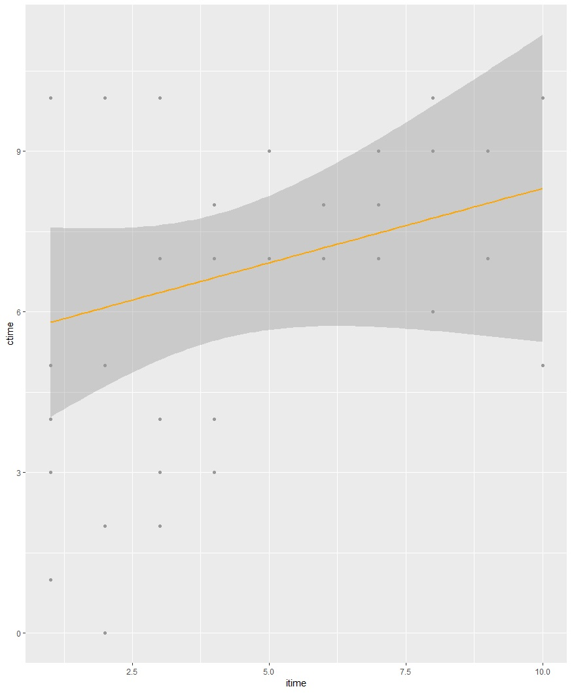

# R_Project
CAPTCHA의 인터넷 브라우저 이용 시간에 따른 인식 분석

#### 주제 선정 배경

주제 : 인터넷 브라우저 이용 시간에 따른 CAPTCHA에 대한 인식 분석

+ 인터넷 사용을 많이 할 수록 회원가입, 본인 인증 등에서 CAPTCHA를 자주 보게 된다. CAPTCHA는 컴퓨터 악성 봇과 사람을 구별하기위해 사용되는 알고리즘 기술이다. 
+ 의류 분야에서 한정판 의류를 구매하여 가격을 올려 되파는 "리셀러"는 자동 구매 봇을 이용해 캡챠를 프로그램으로 통과시켜 대량으로 구매를 한다. 개인으로 의류를 구매하려는 사람들은 봇 프로그램보다 캡챠 통과 속도가 느려 구매를 하지 못해 나중에 "리셀러"에게 추가 금액을 주고 옷을 산다. 이런 이유로  캡챠를 불편하게 여기고, 싫어하는 사람이 많다. 
+ 이 문제를 통해 의류 분야 뿐만 아닌 인터넷을 사용하는 모든 사람들에게 캡챠가 어떻게 인식되는지 알아보기로 하였다.

#### 통계 조사 방법 및 절차

1. 선행연구 조사 

   > 오토 인코더를 통한 캡챠 알고리즘 분석, 캡챠의 새로운 알고리즘 도출 등의 논문

2. 가설 설정

   > 인터넷 사용 시간, 컴퓨터 사용 시간이 증가함에 따라 캡챠를 불필요하다고 여길 것이다.

3. 가설 검증을 위한 자료 수집

   > 구글 설문조사를 이용해 자료 수집

4. 적용한 가설 검증

   > 상관계수 검증, 회귀분석을 통해 검증  

5. 결론 및 제언

   > 인터넷 사용시간이 증가함에 따라 캡챠를 불필요하다고 여긴다.

#### 설문지 분석과 자료 수집

1. 문항1 : 인터넷 사용시간 (0~10시간,0~10점)
2. 문항2: 캡챠 이용 횟수 한달간(0~10회,0~10점)
3. 문항3: 캡챠의 인식(매우 필요하다 ~ 전혀 필요하지 않다,0~5점)

조사 기간: 2019 6월 1일 ~ 2019 6월 21일 

조사 대상: 한국디지털미디어고등학교 재학생 1,2학년

분석 도구: 통계 패키지 R

#### 가설 

1. 인터넷 사용시간이 증가함에 따라 캡챠를 불필요하다고 여길 것이다
2. 인터넷 사용시간에 상관없이 캡챠를 불필요하다고 여길 것이다
3. 인터넷 사용시간과 캡챠는 아무런 연관성이 없다

#### 검증 과정

인터넷 사용시간에 따른 캡챠 이용 빈도 그래프 (회귀분석 이용)

인터넷 사용 시간이 증가함에 따라 캡챠 이용 횟수가 증가한다

인터넷 사용 빈도에 따른 캡챠 인식 그래프 (회귀분석 이용)

(crec : 1 : 매우 필요하다, 2 : 어느정도 필요하다, 3 : 잘 모르겠다, 4 : 필요하지 않다, 5 : 매우 필요하지 않다)

인터넷 사용 빈도가 증가할 수록 캡챠에 대해 부정적으로 인식한다

캡챠 이용 빈도에 따른 캡챠 인식 그래프 (회귀 분석 이용)

캡챠 이용 빈도가 증가할 수록 캡챠에 대해 부정적으로 인식한다

